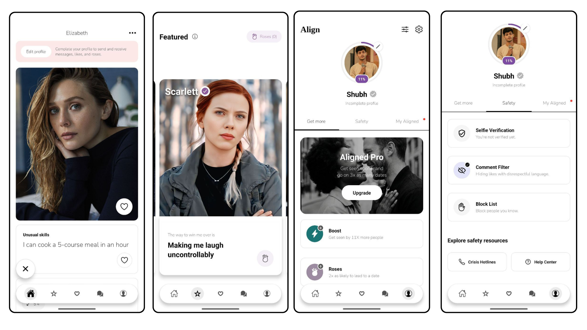
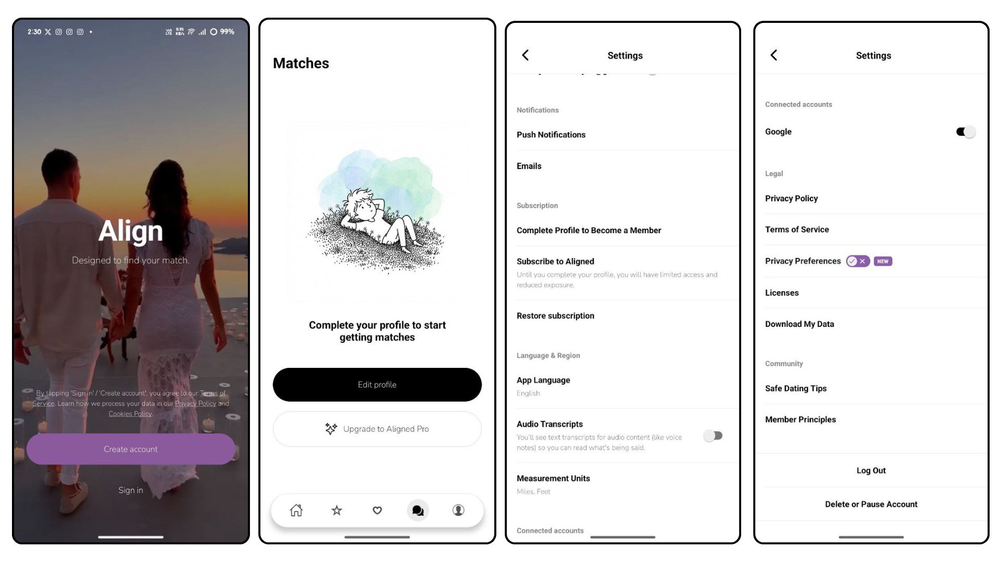

# 💜 Aligned - Dating App

A modern, high-quality dating application built with React Native and Expo. Designed to help people connect meaningfully with features like video splashes, comprehensive profiles, and a smooth user experience.


## ✨ Features

- **📱 Video Splash Screen** - Engaging startup experience
- **🏠 Home** - Discover matches with fluid swipeable profile cards
- **❤️ Likes & Standouts** - See who's interested in you and view curated profiles
- **💬 Messaging** - Real-time chat functionality
- **👤 Profile Management** - Comprehensive profile editing with progress tracking
- **🔐 Auth Flow** - Secure authentication flows
- **🎨 Modern UI** - Clean, Hinge-inspired design with NativeWind styling

## UX




## 🛠️ Tech Stack

| Technology | Purpose |
|------------|---------|
| [Expo](https://expo.dev/) | React Native framework with file-based routing |
| [NativeWind](https://www.nativewind.dev/) | Tailwind CSS for React Native styling |
| [TypeScript](https://www.typescriptlang.org/) | Type safety and better developer experience |
| [Reanimated](https://docs.swmansion.com/react-native-reanimated/) | High-performance 60fps animations |
| [Expo Router](https://docs.expo.dev/router/introduction/) | File-based navigation system |
| [Appwrite](https://appwrite.io/) | Backend as a Service (Database, Auth, Storage) |

## 📦 Installation

1. **Clone the repository**
   ```bash
   git clone https://github.com/subhdotsol/Aligned.git
   cd Aligned
   ```

2. **Install dependencies**
   ```bash
   npm install
   ```

3. **Start the development server**
   ```bash
   npx expo start
   ```

4. **Run on your device**
   - Scan the QR code with Expo Go (Android) or Camera app (iOS)
   - Or press `a` for Android emulator / `i` for iOS simulator

## 📁 Project Structure

```
aligned/
├── app/                    # Application source code
│   ├── (tabs)/            # Main tab navigation
│   │   ├── index.tsx      # Home/Discovery feed
│   │   ├── likes.tsx      # Likes screen
│   │   ├── chats.tsx      # Conversations
│   │   └── profile.tsx    # User profile
│   ├── auth/              # Authentication screens
│   ├── _layout.tsx        # Root layout configuration
│   └── globals.css        # Global styles
├── assets/                 # Images, fonts, and videos
├── components/             # Reusable UI components
├── constants/              # App-wide constants
└── data/                   # Mock data and local static data
```

## 🤝 Contributing

Contributions are welcome! Please feel free to submit a Pull Request.

## 📄 License

This project is open source and available under the [MIT License](LICENSE).

---

**Made with 💜 by Subh**
